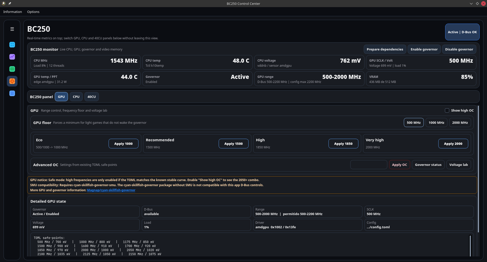
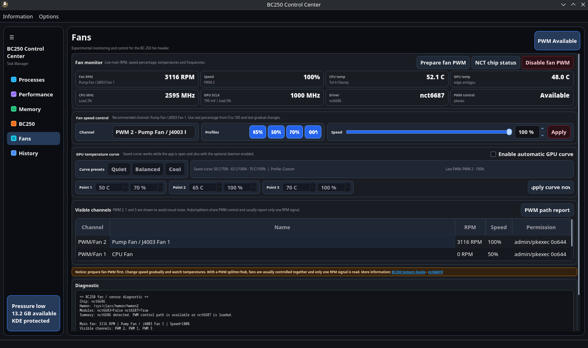
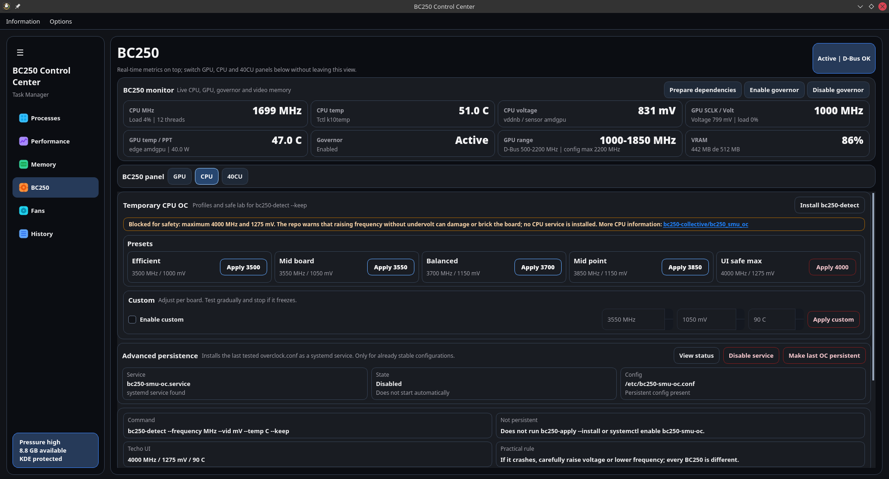
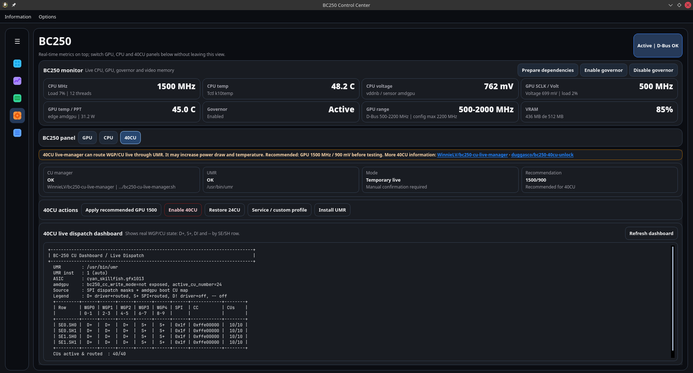
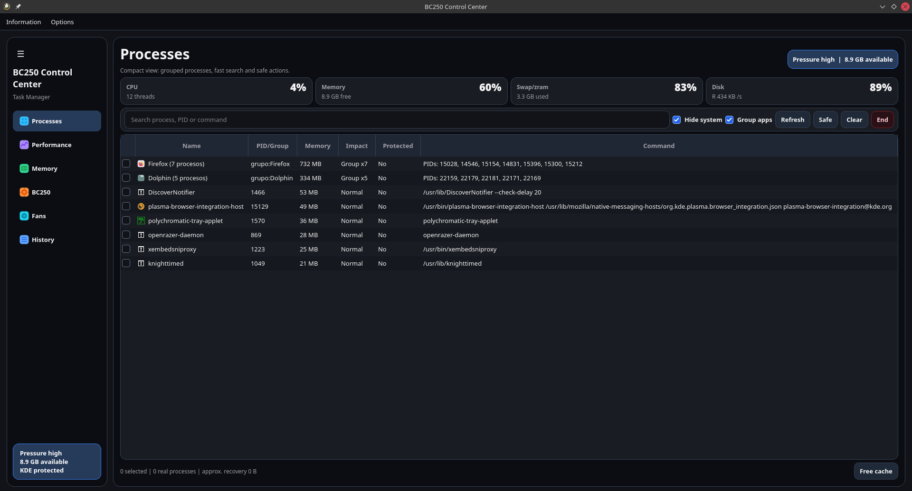
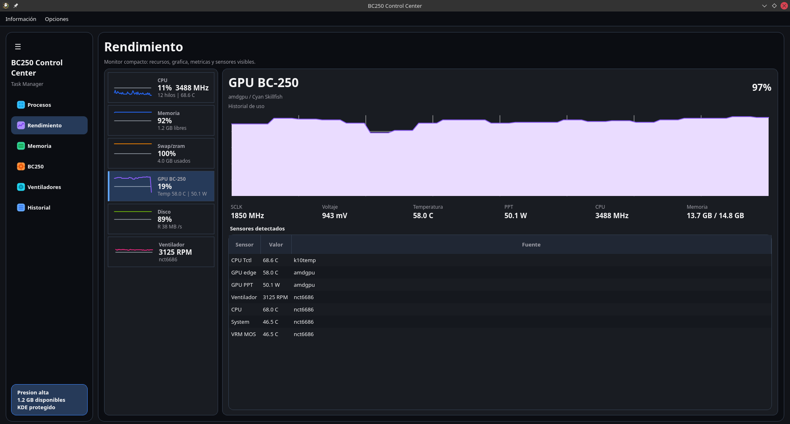

# BC250 Control Center

Graphical interface to manage an AMD BC-250 from Linux. It brings monitoring, processes, memory, GPU, CPU OC, 40CU and fan control into one app, with warnings and validations so you do not have to depend on scattered terminal commands.



<details>
<summary>More screenshots</summary>

### Fans panel



### CPU panel



### 40CU panel



### Processes view



### Performance view



</details>

## Installation

### Quick option with script

Use this option when running from the source code or from a tarball:

```bash
./scripts/install-local.sh
```

Then open the app from your menu or run:

```bash
bc250-control-center
```

If your shell does not find the command, use:

```bash
"$HOME/.local/bin/bc250-control-center"
```

To uninstall that installation:

```bash
./scripts/uninstall-local.sh
```

If you already deleted the project folder, the installer leaves a copy here:

```bash
"$HOME/.local/share/bc250-control-center/scripts/uninstall-local.sh"
```

### Arch AUR

The package is available in AUR:

[https://aur.archlinux.org/packages/bc250-control-center-git](https://aur.archlinux.org/packages/bc250-control-center-git)

Install it on Arch/CachyOS/Manjaro with an AUR helper:

```bash
yay -S bc250-control-center-git
```

or:

```bash
paru -S bc250-control-center-git
```

### Packages by distribution

Stable package files are published in the project releases:

[https://github.com/movacx/bc250-control-center/releases](https://github.com/movacx/bc250-control-center/releases)

Download the file for your distribution from the latest release.

Arch/CachyOS/Manjaro:

```bash
sudo pacman -U ./bc250-control-center-git-*.pkg.tar.zst
```

Fedora/Nobara:

```bash
sudo dnf install ./bc250-control-center-*.fedora.rpm
```

Bazzite/Fedora Atomic:

```bash
sudo rpm-ostree install ./bc250-control-center-*.bazzite.rpm
systemctl reboot
```

Ubuntu/Debian:

```bash
sudo apt install ./bc250-control-center_*.deb
```

If `apt` cannot resolve it directly, use:

```bash
sudo dpkg -i ./bc250-control-center_*.deb
sudo apt -f install
```

## First use

1. Open `bc250-control-center`.
2. Go to **BC250**.
3. Press **Prepare dependencies**. The app selects an isolated strategy for Arch, Manjaro, CachyOS, Debian, Ubuntu, Fedora, Bazzite or SteamOS. On Arch-family systems it verifies the complete AUR toolchain and installs Yay when no supported helper exists. On Bazzite it downloads the user-space tools first, stages all host packages in one `rpm-ostree` deployment and asks for one reboot; a second press is not required.
4. Open **Fans** and press **Prepare fan PWM** when the nct6687 driver is not ready. The app uses the active distribution strategy and reports missing kernel headers or an immutable-system reboot requirement without disabling read-only monitoring. On Bazzite the module is stored per kernel under `/var` and loaded by a persistent system service instead of modifying the immutable module tree.
5. Read **Information > Safe BC250 use** before applying OC, 40CU, fan PWM or persistent changes.

## Main features

- Processes grouped by application.
- Performance view with CPU, memory, swap, GPU, disk, fans and sensors.
- BC250 panel with live metrics.
- GPU control through the `cyan-skillfish-governor-smu` TOML safe-points.
- Temporary and persistent CPU OC with visible limits.
- 40CU/24CU dashboard and actions through `bc250-cu-live-manager`; SteamOS uses a compatible SteamOS live-manager backend.
- Fan module for BC-250 sensors, RPM monitoring, manual fan speed control and a simple GPU temperature curve when `nct6687d` is prepared.
- Local JSONL history.
- Translations from settings.

## Fan module

The fan panel is experimental and focused on the BC-250 fan header. It can show the main fan RPM, CPU/GPU temperatures, PWM status, visible fan channels and diagnostic output. When the `nct6687d` driver is prepared, the app can apply manual speed percentages and a simple GPU temperature curve. Splitters or PWM hubs usually share one control signal and may report only one RPM reading.

## Languages

The interface includes language support for:

- English
- Spanish
- Portuguese
- Simplified Chinese
- Korean
- Russian
- Ukrainian
- German
- French
- Japanese
- Arabic
- Hindi

## External tools and credits

BC250 Control Center does not replace or claim ownership of the community tools. The app installs, clones or runs them from their official sources when needed.

Repositories used or referenced:

- `cyan-skillfish-governor`: https://github.com/filippor/cyan-skillfish-governor/tree/smu
- `bc250_smu_oc`: https://github.com/bc250-collective/bc250_smu_oc
- `bc250-cu-live-manager`: https://github.com/WinnieLV/bc250-cu-live-manager
- `bc250-cu-live-manager-SteamOS`: https://github.com/F5GO/bc250-cu-live-manager-SteamOS
- `bc250-40cu-unlock`: https://github.com/duggasco/bc250-40cu-unlock
- `nct6687d`: https://github.com/Fred78290/nct6687d

More details in `docs/THIRD_PARTY_NOTICES.md`.

## Safety

Overclock, 40CU and frequency changes can cause freezes, shutdowns, data loss or hardware damage. Every BC-250 is different. Test step by step and use it under your own responsibility.

## Quick structure

```text
mvc/                 PyQt6 application
scripts/             launchers and local installer
packaging/           package recipes and outputs
docs/                credits, architecture and project notes
```

Distribution-specific integration lives in `mvc/Repository/Os_repository/`; see `docs/OS_REPOSITORIES.md`.
