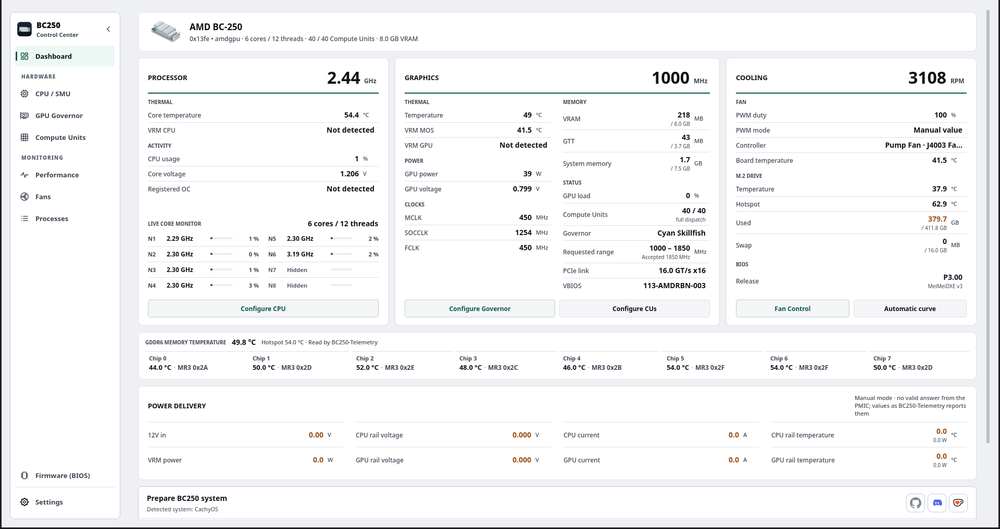

# BC250 Control Center

Linux control center for the AMD BC-250. It brings system monitoring, GPU control, CPU tuning, Compute Units and fan control into one desktop application, with clear limits and validation around hardware changes.

## Screenshots

<table>
  <tr>
    <td width="7%" align="center" valign="middle">
      <a href="https://movacx.github.io/bc250-control-center/gallery/#preparation" aria-label="Previous screenshot" title="Previous screenshot"><kbd>&#10094;</kbd></a>
    </td>
    <td width="86%" align="center" valign="middle">
      <a href="https://movacx.github.io/bc250-control-center/gallery/#dashboard"></a>
    </td>
    <td width="7%" align="center" valign="middle">
      <a href="https://movacx.github.io/bc250-control-center/gallery/#decky" aria-label="Next screenshot" title="Next screenshot"><kbd>&#10095;</kbd></a>
    </td>
  </tr>
</table>

<p align="center">
  <a href="README.md"></a>
  <a href="docs/readmes/README.es.md"></a>
  <a href="docs/readmes/README.pt-BR.md"></a>
  <a href="docs/readmes/README.ru.md"></a>
  <a href="docs/readmes/README.uk.md"></a>
  <a href="docs/readmes/README.de.md"></a>
  <a href="docs/readmes/README.fr.md"></a>
  <a href="docs/readmes/README.pl.md"></a>
  <a href="docs/readmes/README.zh-CN.md"></a>
  <a href="docs/readmes/README.ja.md"></a>
</p>

## Install

### From source

```bash
git clone https://github.com/movacx/bc250-control-center.git
cd bc250-control-center/scripts
./install-local.sh
```

To remove a local installation, run `./uninstall-local.sh` from the same directory.

### Arch, CachyOS and Manjaro

```bash
yay -S bc250-control-center-git
```

### Release packages

Download the package from the [latest release](https://github.com/movacx/bc250-control-center/releases). Fedora, Nobara and Bazzite use the same `noarch` RPM; only the installation method changes because Bazzite uses an immutable system image.

```bash
# Fedora / Nobara
sudo dnf install ./bc250-control-center-*.rpm

# Bazzite / Fedora Atomic — install the same RPM, then reboot into the new deployment
sudo rpm-ostree install ./bc250-control-center-*.rpm
systemctl reboot

# Ubuntu / Debian
sudo apt install ./bc250-control-center_*.deb
```

## First start

1. Open `bc250-control-center`.
2. In the dashboard, choose **Prepare dependencies**. The application selects the supported route for your distribution.
3. Open the module you need and review its status before applying a change.

## What it does

- Live CPU, GPU, memory, storage, network, temperature and fan monitoring.
- Safe GPU governor ranges for Cyan and Oberon.
- Temporary and persistent CPU tuning, plus experimental hidden-core unlocking.
- 24–40 Compute Unit controls with separate live and boot-state reporting.
- Manual PWM control and GPU-temperature fan curves when the supported driver is ready.
- System health checks, diagnostics, history and CSV metric export.
- Desktop localization, interface scaling and optional controller navigation.

## Optional Decky Quick Access

The optional Decky panel is for SteamOS/Game Mode and is installed from BC250 Control Center. It provides bounded GPU, CU, CPU and fan controls while the desktop app remains the place for advanced setup.

After installing the application, open **Dashboard**, scroll to the lower **Decky** section, and select the offered action. The app installs Decky Loader when it is missing, or installs/repairs only BC250 Quick Access when Decky is already available. Normal dependency preparation never installs Decky automatically.

See [the Decky README](integrations/decky/bc250-quick-access/README.md) for the short in-app installation path, supported actions and limits.

## Safety

Overclocking, Compute Unit changes and fan control can cause freezes, shutdowns, data loss or hardware damage. Apply one change at a time, keep a recovery path, and do not treat software checks as hardware validation.

## Languages

The desktop interface supports 30 languages and can follow the system language or be changed in Settings. It includes English, Spanish, Portuguese, Russian, Ukrainian, German, French, Polish, Chinese, Japanese, Korean and more.

## External tools and credits

BC250 Control Center is based on community work and does not claim ownership of these projects. The tools are used solely through explicit, reviewed workflows.

- [cyan-skillfish-governor](https://github.com/filippor/cyan-skillfish-governor/tree/smu) — GPU governor.
- [Oberon Governor](https://gitlab.com/mothenjoyer69/oberon-governor) — supported alternative GPU governor.
- [bc250_smu_oc](https://github.com/bc250-collective/bc250_smu_oc) — CPU SMU detection and tuning.
- [bc250-cu-live-manager](https://github.com/WinnieLV/bc250-cu-live-manager) and [its SteamOS backend](https://github.com/F5GO/bc250-cu-live-manager-SteamOS) — explicit Compute Units workflows; upstream license status remains under review.
- [bc250-core-unlock](https://github.com/rw-r-r-0644/bc250-core-unlock) — experimental CPU core unlock workflow.
- [bc250-steamos](https://github.com/keyboardspecialist/bc250-steamos) and [bc250-gfx1013-fix](https://github.com/DryhoppedIPA/bc250-gfx1013-fix) — explicit compatibility workflows; GFX1013 is restricted to its exact reviewed Fedora 43 host.
- [bc250-fsr4](https://github.com/dmorazasanchez/bc250-fsr4) — explicit per-user, per-game FSR4 V3 workflow for Arch/CachyOS.
- [nct6687d](https://github.com/Fred78290/nct6687d) — NCT sensor and PWM driver support.
- [linux-cachyos-bc250](https://github.com/MastaG/linux-cachyos-bc250) — optional external CachyOS kernel source.

See [third-party notices](docs/THIRD_PARTY_NOTICES.md) for licensing, review status and the exact integration boundary of every project.

## Project layout

```text
src/bc250cc/   application and system logic
frontends/     Desktop Qt, CLI and Quick Access adapters
privileged/    protected helpers and Polkit policy
packaging/     package metadata and distribution setup scripts
scripts/       launchers and local installer
```

Licensed under the [MIT License](LICENSE).
