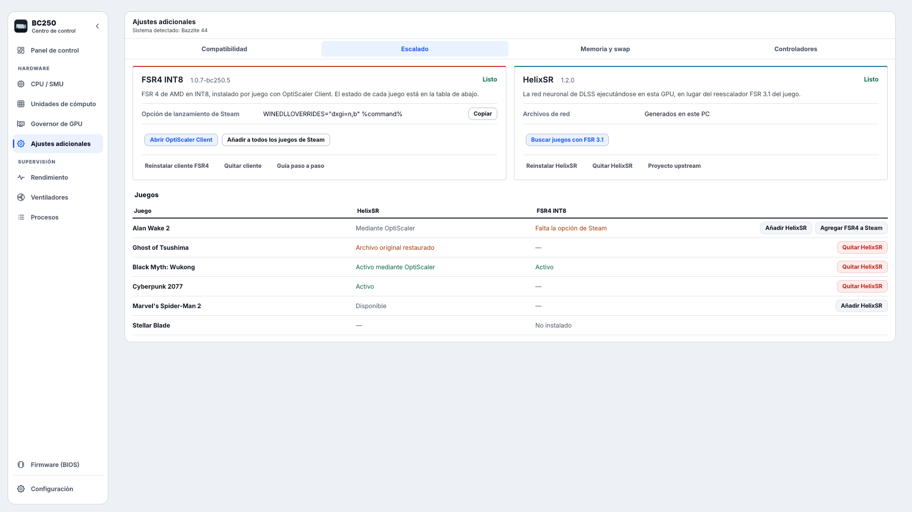
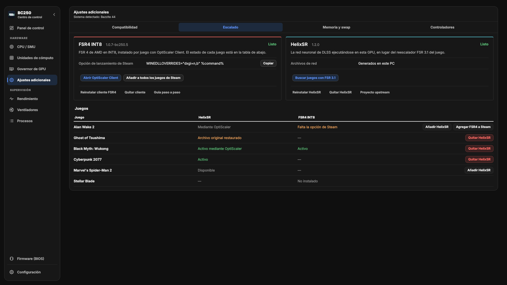

# Escalado — diseño 1

Diseño guardado de la pestaña **Ajustes adicionales › Escalado**: dos paneles
(FSR4 INT8 y HelixSR) con ficha técnica y acciones, y debajo una tabla con una
fila por juego y los botones de cada juego al final de la fila.

- Commit: `b881e8f` en `desarrollo/bc250-control-center`
- Para verlo de nuevo: `git checkout b881e8f -- frontends/desktop/components/dashboard_widgets.py frontends/desktop/theme/__init__.py`

| Claro | Oscuro |
| --- | --- |
|  |  |
