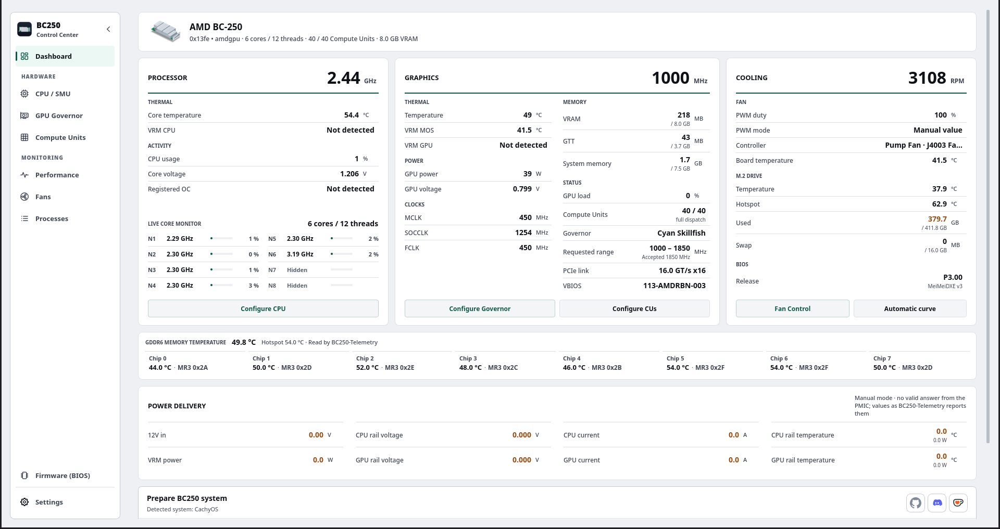

# BC250 Control Center

[English](../../README.md) · [Español](README.es.md) · [Русский](README.ru.md) · [Українська](README.uk.md) · [Deutsch](README.de.md) · [Français](README.fr.md) · [Polski](README.pl.md) · [中文](README.zh-CN.md) · [日本語](README.ja.md)

Central de controle para a AMD BC-250 no Linux. Reúne em um único aplicativo de desktop o monitoramento, o controle da GPU, o ajuste da CPU, as Compute Units, os ventiladores e a atualização do BIOS, com limites claros e validações antes de cada mudança no hardware.

## Capturas de tela

[](https://movacx.github.io/bc250-control-center/gallery/#dashboard)

[Ver todas as capturas →](https://movacx.github.io/bc250-control-center/gallery/#dashboard)

## Instalação

### Arch, CachyOS e SteamOS (AUR)

```bash
yay -S bc250-control-center-git
```

### Pacotes de cada versão

Baixe o pacote do seu sistema na [versão mais recente](https://github.com/movacx/bc250-control-center/releases/latest):

| Sistema | Arquivo |
|---|---|
| Arch / CachyOS / Manjaro | `bc250-control-center-<versão>-any.pkg.tar.zst` |
| Fedora / Nobara / Bazzite | `bc250-control-center-<versão>.noarch.rpm` |
| Ubuntu / Debian | `bc250-control-center_<versão>_all.deb` |

```bash
# Arch / CachyOS / Manjaro
sudo pacman -U ./bc250-control-center-*-any.pkg.tar.zst

# Fedora / Nobara
sudo dnf install ./bc250-control-center-*.rpm

# Bazzite / Fedora Atomic: o mesmo RPM, depois reinicie na nova implantação
sudo rpm-ostree install ./bc250-control-center-*.rpm
systemctl reboot

# Ubuntu / Debian
sudo apt install ./bc250-control-center_*.deb
```

No Debian e no Ubuntu use `apt install` e não `dpkg -i`: assim o APT também baixa as dependências. Se você já usou `dpkg -i` e o pacote ficou pela metade, `sudo apt --fix-broken install` resolve.

### Atualizações

Não é preciso voltar a esta página. Quando sai uma versão nova, o painel avisa, mostra o que mudou e a instala com o gerenciador de pacotes do seu sistema, verificando antes o SHA-256.

No SteamOS a atualização desativa a proteção somente leitura, instala e a reativa. Uma atualização do SteamOS remove tudo o que foi instalado no sistema, inclusive este aplicativo: abra **Reinstall BC250 Control Center** no menu do Modo Desktop e prepare as dependências de novo. O SteamOS pede a senha de `deck`; se você nunca criou uma, execute `passwd` no Konsole antes.

**Vindo da 1.19?** O atualizador dela não consegue instalar pacotes. Atualize uma vez à mão com o pacote da [versão mais recente](https://github.com/movacx/bc250-control-center/releases/latest); depois disso o aplicativo se atualiza sozinho. No Bazzite substitua a 1.19 em um passo e reinicie; se instalou com install-local.sh, remova essa cópia primeiro:

```bash
# Bazzite / Fedora Atomic
sudo rpm-ostree uninstall bc250-control-center --install ./bc250-control-center-*.noarch.rpm
systemctl reboot

# install-local.sh
bash scripts/uninstall-local.sh
```

## Primeiro uso

1. Abra o **BC250 Control Center**.
2. A tela de boas-vindas pergunta o idioma, a aparência e como você quer a barra lateral, e oferece instalar as ferramentas de que a placa precisa. Tudo pode ser alterado depois em **Configurações**.
3. Se quiser, siga o tour guiado: ele percorre cada módulo e explica o que cada um altera na placa.

Antes de aplicar qualquer mudança, confira o estado do módulo: ele diz o que está pronto, o que falta e por quê.

## O que ele faz

**Painel e monitoramento**
- Painel com processador, gráficos e refrigeração, núcleos ao vivo, temperatura de cada chip GDDR6, trilhos de alimentação (com o mod I2C) e o BIOS instalado.
- Módulo de Desempenho com gráficos de CPU, GPU, VRAM, RAM, disco e rede, e uma visão de Sensores com mínimo, média e máximo.

**Hardware**
- **GPU:** faixas seguras do governor para Cyan e Oberon, laboratório de tensão e pontos acima de 2000 MHz.
- **CPU / SMU:** ajuste temporário e persistente, teste de estabilidade e desbloqueio experimental de núcleos ocultos.
- **Compute Units:** de 24 a 40 CU, com o estado ao vivo e o de inicialização separados.
- **Ventiladores:** controle PWM manual, curvas por temperatura, perfis que se mantêm ao reiniciar e exportação para arquivo ou para o Decky.
- **Memória:** tamanho da VRAM, ZRAM, ZSWAP e arquivo de swap.
- **Firmware (BIOS):** prepara um USB de atualização com P3.00 Chipset Menu, MeiMeiDXE v3, P5.00, P3.00 ou P2.00, com cada arquivo verificado.

**Sistema**
- Preparação de dependências adaptada a cada distribuição, com um terminal integrado que mostra cada comando.
- Correções de compatibilidade: GFX1013 e async compute, FSR4 por jogo, telemetria e ACPI.
- Drivers de Wi-Fi, Bluetooth e impressoras a partir dos repositórios oficiais da sua distribuição.
- Diagnósticos, histórico e exportação de métricas para CSV.

**Interface**
- Temas Claro, Escuro e Azul-noite, estilos Padrão e Formal, 10 cores de destaque e escala de 70 % a 150 %.
- 30 idiomas e navegação por controle.

## Decky Quick Access (opcional)

Um painel para o menu de acesso rápido do SteamOS e o Modo Jogo da Steam. Traz os controles do dia a dia (GPU, CU, CPU, ventiladores e VRAM) sem sair do jogo; a configuração avançada continua no aplicativo de desktop.

- **Perfis por jogo:** atribua a cada jogo um perfil de GPU e de ventiladores. Ele é aplicado ao abrir o jogo e tudo volta ao normal ao fechá-lo.
- **Async compute ao vivo:** mostra se o jogo está usando computação assíncrona, e quanto.
- **Presets de ventiladores:** com os nomes e velocidades que você exportar do desktop.

Para instalar, abra o **Painel**, desça até a seção **Decky** e escolha a ação oferecida. Se faltar o Decky Loader, o aplicativo o instala; se ele já existir, instala ou repara apenas o BC250 Quick Access. A preparação normal de dependências nunca instala o Decky por conta própria.

Mais detalhes no [README do Decky](../../integrations/decky/bc250-quick-access/README.md).

## Segurança

Overclock, mudanças de Compute Units, controle de ventiladores e atualização do BIOS podem travar ou desligar o sistema, causar perda de dados ou danificar o hardware. Aplique uma mudança de cada vez, tenha sempre um jeito de voltar atrás e não trate as verificações do aplicativo como garantia do hardware.

## Ferramentas externas e créditos

O BC250 Control Center se apoia no trabalho da comunidade e não reivindica nenhum destes projetos como seu. Cada ferramenta é usada apenas por meio de fluxos explícitos e revisados.

**GPU**
- [cyan-skillfish-governor](https://github.com/filippor/cyan-skillfish-governor/tree/smu): governor da GPU.
- [Oberon Governor](https://gitlab.com/mothenjoyer69/oberon-governor): governor alternativo compatível.
- [bc250-gfx1013-fix](https://github.com/DryhoppedIPA/bc250-gfx1013-fix) e [bc250-steamos](https://github.com/keyboardspecialist/bc250-steamos): kernel e Mesa/RADV para GFX1013.
- [linux-cachyos-bc250](https://github.com/MastaG/linux-cachyos-bc250): kernel e Mesa/RADV pareados para Arch/CachyOS.
- [bc250-async-compute-bazzite](https://github.com/tri3gubki-ops/bc250-async-compute-bazzite): async compute no Bazzite 44.
- [bc250-fsr4](https://github.com/dmorazasanchez/bc250-fsr4) e [bc250-fsr4-fork](https://github.com/daniel-h-0/bc250-fsr4-fork) (OptiScaler Client): FSR4 por jogo.
- [HelixSR](https://github.com/lonewolf0622/HelixSR): reconstrução com DLSS Model E para jogos com FSR 3.1, por jogo.

**CPU e Compute Units**
- [bc250_smu_oc](https://github.com/bc250-collective/bc250_smu_oc): detecção e ajuste da CPU pelo SMU.
- [bc250-core-unlock](https://github.com/rw-r-r-0644/bc250-core-unlock) e [bc250-efi-core-unlock](https://github.com/Hexxeh/bc250-efi-core-unlock): desbloqueio de núcleos.
- [bc250-cu-live-manager](https://github.com/WinnieLV/bc250-cu-live-manager), [SteamOS](https://github.com/F5GO/bc250-cu-live-manager-SteamOS) e [bc250-40cu-unlock](https://github.com/duggasco/bc250-40cu-unlock): Compute Units.
- [bc250-acpi-fix](https://github.com/e-tho/bc250-acpi-fix): estados de desempenho da CPU via ACPI.

**Sensores, memória e ventiladores**
- [BC250-Telemetry](https://github.com/onlinermm/BC250-Telemetry): telemetria dos reguladores (VRM).
- [bc250-memory-temperature](https://github.com/pan-Rijovich/bc250-memory-temperature): temperatura da memória GDDR6.
- [bc250_memcfg](https://github.com/fanoush/bc250_memcfg): tamanho da VRAM via CMOS.
- [nct6687d](https://github.com/Fred78290/nct6687d): sensores NCT e PWM dos ventiladores.

**Firmware**
- [bc250-bios](https://gitlab.com/TuxThePenguin0/bc250-bios): BIOS P3.00 original e Chipset Menu.
- [AMD-BC-250-UEFI-v2.2-Firmware-Menu-Script](https://github.com/Forbidden-Darkness/AMD-BC-250-UEFI-v2.2-Firmware-Menu-Script): UEFI Shell e MeiMeiDXE v3.
- [BC-250](https://github.com/kenavru/BC-250): cópia do kit de atualização da ASRock (P2.00 e P5.00).
- [bc250-custom-bios-logo](https://github.com/tmghd272/bc250-custom-bios-logo): logotipo de inicialização personalizado.

As licenças, o estado de revisão e o escopo exato de cada integração estão nos [avisos de terceiros](../THIRD_PARTY_NOTICES.md).

## Estrutura do projeto

```text
bc250-control-center/
├── src/bc250cc/          O núcleo, sem interface gráfica
│   ├── domain/           Regras e limites de cada módulo (GPU, CPU, CU, ventiladores, firmware…)
│   ├── application/      Casos de uso que combinam essas regras
│   ├── infrastructure/   Acesso ao sistema: sensores, serviços, pacotes, GitHub
│   ├── platform/         Diferenças entre distribuições e sistemas de init
│   └── shared/           Versão, caminhos e contratos compartilhados por todos os processos
├── frontends/
│   ├── desktop/          Aplicativo de desktop em Qt
│   │   ├── pages/        Um arquivo por módulo (painel, GPU, CPU, ventiladores, firmware…)
│   │   ├── components/   Peças reutilizáveis da interface
│   │   ├── onboarding/   Tela de boas-vindas e tour guiado
│   │   ├── console/      Terminal integrado
│   │   ├── theme/        Temas, estilos, cores e ícones
│   │   └── i18n/         Traduções para 30 idiomas
│   └── cli.py            Modo de linha de comando
├── integrations/decky/   Plugin Decky Quick Access para o Modo Jogo
├── privileged/           O que roda como root, isolado e revisado
│   ├── helpers/          Um auxiliar por tarefa privilegiada
│   ├── lib/              Código compartilhado por esses auxiliares
│   └── policies/         Permissões do Polkit
├── packaging/            Pacotes .pkg.tar.zst, .rpm e .deb, e o PKGBUILD do AUR
├── scripts/              Lançadores, instalador local e utilitários de sistema
├── assets/               Ícones, capturas e galeria web
├── docs/                 Documentação, avisos de terceiros e traduções deste README
└── tests/                Mais de 4000 testes automatizados
```

Licença [MIT](../../LICENSE).
