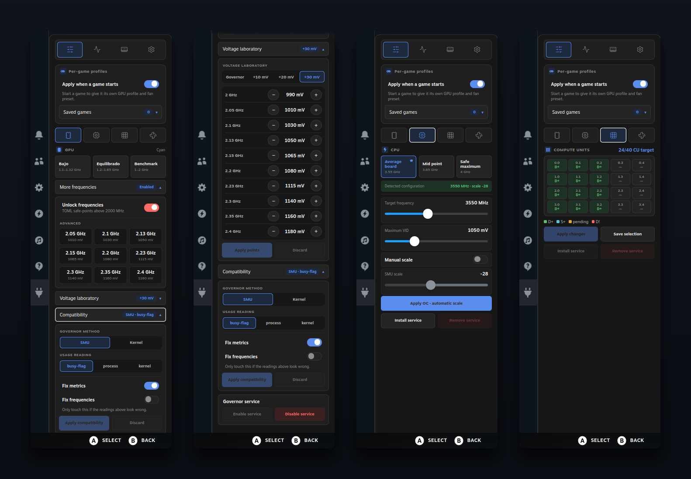
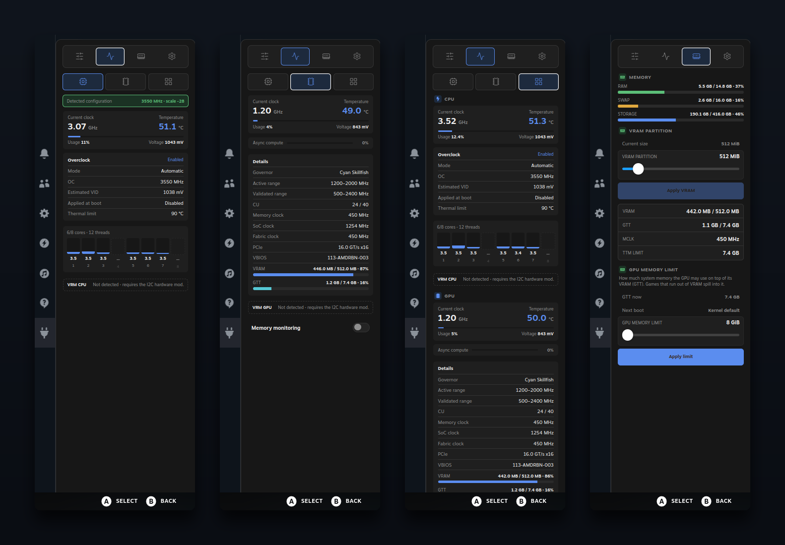

# BC250 Quick Access (Decky)

Optional Game Mode panel for BC250 Control Center. It is designed for controller use and offers a small set of verified hardware actions; it does not replace the desktop application.

## Screenshots

| Board setup | Monitoring |
|---|---|
|  |  |

## Available controls

- GPU: conservative Cyan ranges and already validated safe-points.
- Compute Units: live 4×5 WGP selection, saved boot table and service actions.
- CPU: bounded detector, temporary profile and validated scale test.
- Fans: manual PWM 2–5 control and return to automatic mode.
- Memory & video: VRAM size (CMOS) and the GPU memory limit (TTM `pages_limit`, how much system memory the GPU may use as GTT). Both take effect at the next reboot, and a change made in Desktop Mode shows up here as pending too.

The panel shows live status while it is open and keeps Desktop and Quick Access CU and memory state synchronized. Advanced GPU voltage editing, arbitrary commands, firmware work, swap/zram/zswap policy and fan curves remain in the desktop application or are intentionally unavailable.

### GPU memory limit (TTM)

amdgpu sizes its GTT domain once, when the driver loads, so the limit is a kernel boot argument. The panel never writes it itself: it goes through the desktop's own `bc250-system-setup-helper` (`ttm-status` / `ttm-apply`), so Desktop Mode and Game Mode read and change one state.

| System | How the limit is kept |
|---|---|
| CachyOS (Limine) | marked block in `/etc/default/limine`, then `limine-mkinitcpio` |
| Arch, CachyOS, Manjaro (GRUB) | marked block at the end of `/etc/default/grub` (upstream GRUB does not read `grub.d`) |
| Debian, Ubuntu (GRUB) | drop-in in `/etc/default/grub.d`, then `update-grub` |
| Fedora, Nobara | `grubby --update-kernel=ALL`, only the argument it added |
| Bazzite and other rpm-ostree images | `rpm-ostree kargs`; what was there before is saved in `/etc/bc250-control-center/ttm-kargs.original` and put back on restore |
| SteamOS, systemd-boot, rEFInd | not managed; the panel says why and shows the exact `ttm.pages_limit=` value to add by hand |

A `ttm.pages_limit` set by another tool is reported and left alone, `amdgpu.gttsize` (which overrides the limit) is reported, and a limit larger than the memory the next boot will have — for example after choosing a bigger VRAM size — is not offered.

## Install

BC250 Quick Access is installed from **BC250 Control Center**, not as a standalone plugin download.

1. Install and open BC250 Control Center in Desktop Mode.
2. Open **Dashboard** and scroll to the lower **Decky** section.
3. Choose **Install Decky + Quick Access (Beta)** when Decky Loader is missing, or **Install / repair BC250 Quick Access** when Decky is already present.
4. Review the terminal result, then restart Game Mode or reload Decky.

The application detects the existing Decky state and uses the appropriate official/bootstrap route before deploying the BC250 plugin. SteamOS is the primary target; Bazzite and CachyOS Game Mode are compatibility targets.

## Safety

Every action is checked again by the root-owned helper and read back when possible. Hardware validation on the target BC-250 is still required before release.
